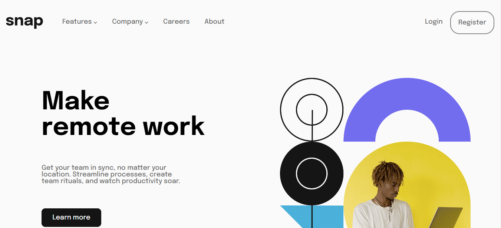

# Frontend Mentor - Intro section with dropdown navigation solution

This is a solution to the [Intro section with dropdown navigation challenge on Frontend Mentor](https://www.frontendmentor.io/challenges/intro-section-with-dropdown-navigation-ryaPetHE5). Frontend Mentor challenges help you improve your coding skills by building realistic projects. 

## Table of contents

- [Overview](#overview)
  - [The challenge](#the-challenge)
  - [Screenshot](#screenshot)
  - [Links](#links)
- [My process](#my-process)
  - [Built with](#built-with)
  - [What I learned](#what-i-learned)
- [Author](#author)

## Overview

### The challenge

Users should be able to:

- View the relevant dropdown menus on desktop and mobile when interacting with the navigation links
- View the optimal layout for the content depending on their device's screen size
- See hover states for all interactive elements on the page

### Screenshot



### Links

- Solution URL: [Add solution URL here](https://www.frontendmentor.io/solutions/responsive-landing-page-with-dropdown-navbar-yEKcb5pbnr)
- Live Site URL: [Add live site URL here](https://frontend-mentor-intro-dropdown.netlify.app/)

## My process

### Built with

- Semantic HTML5 markup
- CSS custom properties
- Flexbox

### What I learned

I learned how to do a dropdown menu with HTMl and CSS. Here is the HTML for the dropdown
```html
<li class="dropdown">
  <p id="drop">Features </p>
    <div class="dropdown-content">
      <ul>
        <li> Todo List</li>
        <li> Calendar</li>
        <li> Reminders</li>
        <li> Planning</li>
      </ul>
     </div>
</li>
```
I used css styling to show the dropdown when the user hovers over the text.
```css
.dropdown:hover .dropdown-content {
    display: block;
}
```
I used JavaScript to handle the mobile menu for the navbar.

## Author

- Website - [Jekari Rawls](https://jekarirawlsportfolio.netlify.app/)
- Frontend Mentor - [@Jekari99](https://www.frontendmentor.io/profile/Jekari99)